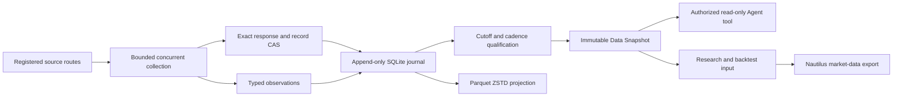
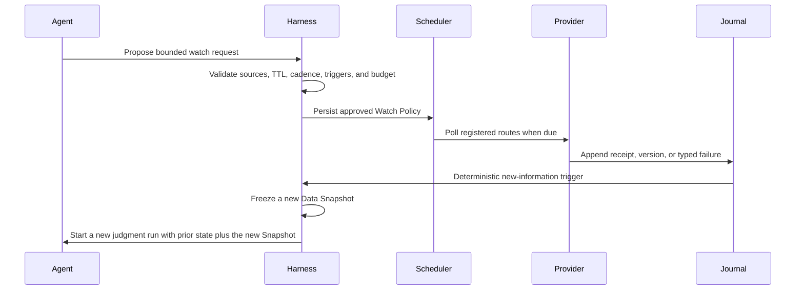

# Data platform plan

The data platform continuously turns registered upstream responses into auditable point-in-time
receipts, typed observations, compressed analytical datasets, and explicitly authorized Agent
inputs. It does not make a current backfill historically point-in-time, grant execution authority,
or remove the need for source licensing and route acceptance.

## What is accepted now

The smallest complete local data plane is:



SQLite and the content-addressed artifact store are the receipt and identity authority on one
machine. PyArrow writes immutable Parquet/ZSTD analytical projections. A Data Snapshot is the only
frozen query result that the current Agent tool or a Backtest Request may bind. Nautilus remains a
consumer of execution-grade market data; it is not the news, evidence, source-policy, or orchestration
authority.

The implementation intentionally does not add Kafka, a database server, a scheduler service, or a
lakehouse table format. Those components become justified only when measured concurrency, volume,
retention, or multi-host operation exceeds the local design's gates below.

## Responsibilities by layer

| Layer | Owns | Current implementation | Must not own |
| --- | --- | --- | --- |
| Source registration | Exact upstream, final URL or endpoint, Provider/parser version, license scope, credentials reference, and route hash | Versioned source configuration and Provider manifest | PIT qualification, Agent policy, secrets in artifacts |
| Acquisition | Bounded concurrent fetch, timeouts, response limits, actual receipt clock, redirects, retry classification, and typed failures | Provider adapters; RSS/Atom proves the generic feed path and CSRC is the first accepted A-share official-event route | Historical authority inference, silent fallback, order submission |
| Raw receipt | Exact accepted response and selected record bytes with SHA-256 identity | Private content-addressed artifact store | Normalized truth, mutable cache eviction by default |
| Normalization | Provider-specific parsing into canonical Source Observations | Provider adapter plus shared observation contract | Cross-source causal inference, overwrite of earlier revisions |
| Receipt journal | Every collection snapshot, source attempt, observation version, first actual receipt, and repeat sighting | SQLite WAL with foreign keys, full synchronous commits, and one logical writer | Article search engine, analytical warehouse, broker state |
| Analytical storage | Columnar scans, compression, partition pruning, and reproducible exports | PyArrow Parquet, ZSTD, partitioned by capability and first-available date | Receipt authority, transactions, source admission |
| Snapshot qualification | Cutoff, source set, cadence, gap/failure checks, exact version selection, and completeness | Standard content-identified Data Snapshot | Model inference, Evidence promotion, execution acceptance |
| Query/tool layer | Domain filters over an already frozen and run-authorized Snapshot ID | `FrozenDataSnapshotToolBinding` | Arbitrary URL, source, cutoff, path, credentials, or cache-mode selection by the Agent |
| Research/execution adapters | Feature views, backtest inputs, and raw tradable market-data export | Harness contracts and Nautilus adapter | A second orchestration authority or adjusted-price fills |

## Keep the data families distinct

One physical database is not one semantic model. The Harness uses three storage families with a
shared identity and cutoff vocabulary:

| Family | Examples | Storage/query shape | Time/version requirement |
| --- | --- | --- | --- |
| Event and expectation facts | Official releases, announcements, publisher feeds, consensus and forecast observations | Append-only versions plus exact raw receipt; text/metadata selected into Data Snapshots | Publication/update fields remain distinct from first actual receipt and historical authority |
| Effective-dated dimensions | Instrument lifecycle, exchange, board, industry membership, index constituents, symbol mapping | Valid-from/valid-to dimension rows with source/taxonomy version | Query by decision cutoff; current membership never backfills an older universe |
| Market and execution series | Raw bars/ticks, limits, corporate actions, total-return or adjusted research views | Parquet partitions and, after acceptance, Nautilus `ParquetDataCatalog` export | Raw tradable prices for fills; as-of adjusted values for research; provider/version bound to cutoff |

Derived features are reproducible consumers. They retain the input Snapshot IDs, feature code/version,
parameters, output hash, and decision cutoff. A feature store may be added later for repeated online and
offline retrieval, but it cannot repair missing source authority or become another source of truth.

## Collection and freeze workflow

### Start bounded or continuous feed collection

The checked-in Federal Reserve route is a public prospective-path example, not an A-share relevance
claim:

```bash
market-impact data collect-feed \
  --source-config examples/providers/federal-reserve-press-feed-v1.json \
  --window-start 2026-08-28T07:00:00Z \
  --poll-interval-seconds 300 \
  --maximum-gap-seconds 600 \
  --cycles 2
```

`--cycles 0` runs until interrupted. Every cycle still executes a normal Data Query, records every
source attempt, and appends it to the journal. Repeated content creates another sighting but not
another observation version. Changed content under the same lineage creates an immutable new
version. A collection policy is content-identified from capability, exact sources, collection
window, query filters, cadence, and maximum tolerated gap; changing any of them creates a new policy
instead of mixing incompatible receipts.

### Freeze one decision-time input

```bash
market-impact data freeze-feed-dataset \
  --policy-id prospective-collection-policy-<sha256> \
  --window-start 2026-08-28T07:00:00Z \
  --not-after 2026-08-28T07:10:00Z
```

The requested `not_after` is an upper bound. The resulting Data Snapshot reports the last actual
receipt selected as its effective cutoff; it never invents a receipt at the requested time. Missing
start coverage, an internal gap, a stale final receipt, or a failed source attempt makes the Snapshot
incomplete. Incomplete Snapshots remain auditable but cannot be registered as a frozen Agent tool.

Only a complete freeze emits a content-identified Parquet/ZSTD manifest. The manifest binds the
exact Data Snapshot ID, lower bound, effective cutoff, source receipts, and coverage result, and its
row set equals that Snapshot's observations. Exact source response and record bytes remain in the
private content-addressed store and are deduplicated by hash.

## Follow one event without keeping a model alive

Real-time trading needs bounded follow-up after an important release. The safe abstraction is an
**Attention Watch**, not a model process that remains connected to the network.



The Agent may propose what to follow, but the Harness owns approval, scheduling, canonical state,
and wake-up. The accepted minimum Watch Policy content-binds:

- the originating event or Judgment ID and canonical event-cluster key;
- authorized semantic query, source routes, optional search terms, and target entities;
- one existing Prospective Collection Policy, whose fixed cadence remains the single cadence
  authority, plus start time, expiry/TTL, maximum polls, captured bytes, and Agent wake count;
- the deterministic `new_observation_version` trigger;
- wake-only cooldown and an internal duplicate key;
  and
- the prior Snapshot/Judgment lineage that a triggered run must cite.

`AttentionWatchService.create` accepts only a complete Journal-frozen aggregate covering the full
Collection Policy window, with no receipts after Watch creation, so every version already present
at that baseline is seeded into the durable seen set. `run_due`
atomically claims eligible work with an expiring SQLite lease before calling a collector bound to
the stored Prospective Collection Policy. This prevents concurrent supervisors from advancing
poll/byte/wake state or the outbox twice while still allowing recovery after a crashed worker.
Every attempt writes through the same Prospective Receipt Journal. A complete collection is frozen
through the existing Snapshot path before version comparison. When nothing changed, no wake is
created. When a new version appears outside cooldown, one content-identified pending wake binds the
prior and new complete Snapshot IDs. A separate Harness-owned consumer may start a fresh bounded
Judgment run and acknowledge delivery; the Watch does not mutate the previous run or send an order
directly.

Implemented states are `active`, `backing_off`, `triggered`, `expired`, and `cancelled`.
Typed source failures and raised collector exceptions back off without terminally disabling the
Watch, while explicit cancellation revokes any outstanding lease. A receipt gap remains
fail-closed: later successful polls do not rewrite history, and wake eligibility resumes only from
an explicitly approved new complete baseline/policy. Tests cover aggregate-baseline admission,
no-change, revision trigger, restart/repeat deduplication, concurrent and expired leases, expiry,
poll budget, source/collector failure, cancellation, cooldown that continues receipt cadence,
complete-Snapshot gating, and idempotent delivery acknowledgement. The current runtime is an
in-process `run_due` component for an external supervisor; it does not install a daemon, launch a
model, or provide adaptive cadence, corroboration/materiality triggers, conditional HTTP, jitter,
or event-cluster coalescing yet.

For latency-critical prices and order books, use licensed streaming market data and sequence-gap
recovery rather than webpage/RSS polling. Attention Watch is best for news, announcements,
expectation changes, corroboration, and evolving event narratives. It grants read and wake-up
authority only; any paper or live order still passes the normal Signal, mandate, policy,
reconciliation, and kill-switch gates.

## Source acceptance before integration

Every source, whether free, paid, direct, or aggregated, passes the same route gates:

| Gate | Required evidence | Rejection examples |
| --- | --- | --- |
| Rights and identity | Exact provider/product, endpoint and final redirect, retention/use terms, entitlement, source configuration hash | Unclear scraping rights, anonymous mirror, credentials embedded in configuration |
| Transport | HTTPS or licensed stream, timeout/body bounds, response identity, receipt time, typed rate-limit/error behavior | Redirect drift, empty success, unbounded page or stream |
| Completeness | Pagination/cursor rules, calendar or sequence gap checks, row/byte bounds, explicit no-data behavior | First-page-only data, sequence gaps, empty fallback reported as success |
| Time and revisions | Occurred, published, source-updated, received/available, authority times, revision lineage | Current query time used as historical authority, later correction overwriting the earlier value |
| Market semantics | Instrument identity, currency/calendar, raw/adjusted/total-return basis, taxonomy effective dates, corporate actions | Current constituents in an old universe, adjusted bar used as a fill price |
| Determinism and storage | Exact raw hash, parser and schema version, deterministic re-import, private retention classification | Row identity drift, missing raw receipt, licensed payload committed to Git |
| Agent isolation | Complete frozen Snapshot ID declared by the enclosing run | Agent chooses URL, Provider, cutoff, path, credentials, or live cache behavior |

Aggregator feeds are discovery routes until the canonical publisher identity and version are
verified. Their discovery or fetch time never becomes publisher publication time. A paid vendor
backfill can enter strict historical PIT only when its product contract supplies an immutable
historical version/delivery authority at or before the decision cutoff.

The first completed use of this matrix is the CSRC official-publication route. Its private
`source-route-acceptance-report-0671f5669de1cd78741350d8cb373a5fbd8d4535cb5efafcb1b5a5714a8d7216`
binds a captured legal notice, exact Provider and route hashes, three prospective actual-receipt
observations, and an identical isolated replay. Passing the route accepts private prospective event
collection only; the report schema prevents it from claiming historical PIT, Evidence promotion, or
execution capability.

## A-share source route order

The first useful A-share implementation batch should stay narrow and checkpoint-driven:

1. Register official event and disclosure routes from exchange, regulator, government, and issuer
   sources whose automated-use and retention terms pass review.
2. Obtain market/index, then-effective industry taxonomy and membership, margin/positioning, and
   macro-vintage samples through public or entitled routes. Freeze one small acceptance export
   before implementing a broad vendor adapter.
3. Materialize effective-dated instrument and exposure mappings so the Agent can query tradable ETF,
   index, and stock candidates without choosing a Provider or current universe.
4. Freeze two or three representative checkpoint inputs containing the observed event fact, cited
   prior expectation, market and sector context, positioning, registered horizon choices, and
   executable universe.
5. Only after those Snapshots are complete, run three paired Agent replicates. Historical strict PIT,
   prospective paper evaluation, and live execution remain separate admission lanes.

Public exchange pages can be prospective inputs only after route and rights acceptance. Licensed
SZSE market feeds, CSI/CNI taxonomy data, Wind, Bloomberg, LSEG, or similar products require a
version/timestamp and retention trial; a vendor name alone is not acceptance. Tushare remains a
practical research connector, but an old date returned today does not itself prove old visibility.

## Adopted and deferred infrastructure

| Component | Decision now | Reason and evolution trigger |
| --- | --- | --- |
| SQLite WAL | Adopt as local journal/index authority | Durable, transactional, available in the runtime; move to PostgreSQL only for measured multi-process or multi-host writes |
| Content-addressed files | Adopt for exact raw receipts and JSON manifests | Immutable identity and natural duplicate suppression; move bytes to object storage when local retention or backup limits require it |
| PyArrow + Parquet/ZSTD | Adopt for normalized analytical projection | Compact, portable columnar data with predicate-friendly layout |
| DuckDB | Optional read/materialization adapter | Add when SQL over many Parquet partitions materially simplifies analysis; never make it receipt authority |
| Polars | Optional transformation adapter | Add for measured transformation bottlenecks, not as a catalog or PIT authority |
| Nautilus `ParquetDataCatalog` | Adopt only for accepted execution-grade instruments/bars/ticks | Keeps replay and paper/live market semantics aligned without storing news or Evidence there |
| `asyncio` | Adopt inside Provider collection for concurrent registered sources | Add bounded jitter/backoff and conditional HTTP per Provider as acceptance requires |
| APScheduler | Defer | Add only when durable persisted schedules and misfire recovery are required beyond an external process supervisor |
| Kafka/Redpanda | Defer | Add only for measured high-rate streams, multiple consumers, replay partitions, and operational ownership |
| Iceberg/Delta/Hudi | Defer | Add only after object-storage scale requires catalog commits, schema evolution, compaction, and multi-writer table transactions |
| Feast or another feature store | Defer | Add after stable features need repeated offline/online PIT retrieval; source Snapshots remain the authority |

## Performance, retention, and recovery

- Keep one logical SQLite writer. Use WAL, foreign keys, `synchronous=FULL`, a bounded busy timeout,
  regular integrity checks, and backups that include the database plus WAL state.
- Deduplicate raw bodies and normalized versions by content identity. Never delete an earlier revision
  because a publisher or vendor later corrected it.
- Partition analytical files by capability and first-available UTC date. Use ZSTD, dictionaries,
  statistics, bounded row groups, temporary files, atomic rename, and content-hashed final names.
- Keep indexes and small manifests hot. Scan Parquet through PyArrow, optional DuckDB, or optional
  Polars; do not load article bodies into Agent context by default.
- Retention is source-specific. Metadata, exact excerpts, full text, ticks, and licensed exports may
  have different private-retention and redistribution rules; the source configuration records that
  scope before collection.
- A restore is accepted only when content hashes, SQLite relationships, collection policy identity,
  Parquet row counts, and frozen Snapshot reconstruction all verify. Transport success alone is not
  recovery acceptance.

## Evolution gates

| Gate | Evidence required before expansion | Expansion unlocked |
| --- | --- | --- |
| Provider gate | One frozen sample passes rights, transport, completeness, time/version, semantics, and deterministic replay | Implement that source's production adapter |
| Dataset gate | Sustained polling proves cadence, typed failure recovery, version capture, storage growth, and restore | Run an externally supervised prospective collector |
| Watch gate | The fixed-cadence/new-version core has durable policy state, TTL/budget enforcement, duplicate suppression, restart recovery, complete-Snapshot gating, and an idempotent wake-up outbox; supervisor and richer-trigger acceptance remain | Let the Harness persist bounded Watch policies; defer automatic Agent proposal/dispatch |
| Query gate | Representative event/expectation/market/universe Snapshots are complete and useful to the Agent | Run the two-to-three-checkpoint paired experiment |
| Paper-data gate | Prospective decision inputs and execution-grade market data remain synchronized through replay and reconciliation | Connect the separate paper execution outbox |
| Scale gate | Measured write contention, data volume, query latency, or multi-host consumers exceed local limits | Evaluate PostgreSQL, object storage, stream log, or lakehouse catalog |
| Live gate | Versioned mandate, idempotent order identity, limits, reconciliation, kill switch, and explicit acceptance evidence | Enable a reviewed live adapter; never unlocked by data readiness alone |

## Evidence, finding, and implementation path

| Evidence | Finding | Path |
| --- | --- | --- |
| Existing Harness already binds queries, Provider routes, immutable Snapshots, and authorized read-only tools | The missing unit is a durable prospective receipt/version plane, not another orchestrator | Append each actual collection to the journal, freeze a complete Snapshot, then reuse the existing tool binding |
| Historical strict qualification is still incomplete even after archive recovery | Current backfills and rolling feeds cannot authenticate every 2018–2024 cutoff | Keep strict recovery/vendor trials separate while collecting authoritative future receipts now |
| Official SQLite, Arrow/Parquet, DuckDB, and Nautilus contracts cover the required local responsibilities | A small composable stack is sufficient before scale evidence exists | Adopt SQLite/CAS and Parquet now; keep DuckDB/Polars optional; defer distributed infrastructure |
| Exchange and vendor routes have different access, taxonomy, and licensing contracts | One generic web scraper would hide material data semantics and rights | Use Provider-specific adapters behind one canonical observation/snapshot contract and one acceptance matrix |

## Current limitations

- The continuous CLI is a foreground collector. Process restart supervision, durable scheduler
  misfires, conditional HTTP caching, per-source jittered backoff, and source-specific stream gap
  recovery remain Provider/operations gates, not implied capabilities.
- Attention Watch provides durable `run_due` state and a local pending/delivered outbox, but no
  installed scheduler or Agent-run dispatcher. An external supervisor must call it, and only the
  new-observation-version trigger is accepted.
- One A-share official-event route is accepted for prospective private research. It is not a
  complete A-share decision feed: market/index, effective-dated industry, positioning, macro
  vintage, expectation, and tradable-universe routes are still unaccepted.
- Strict historical qualification remains unchanged until new historically authoritative records
  are materialized and requalified.
- No model experiment, paper order, or live order is authorized by this data-platform slice.
