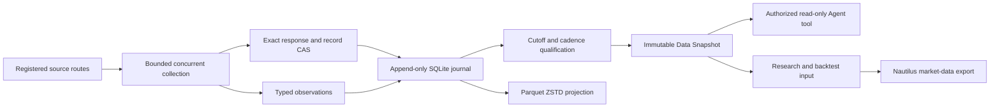
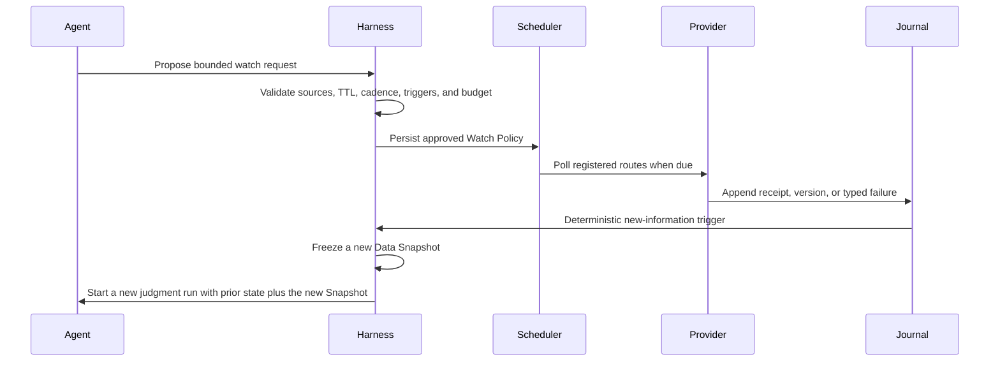
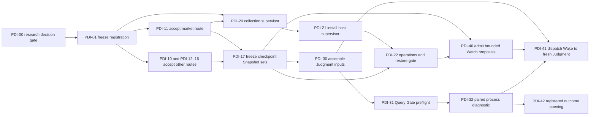

# Data platform plan

The data platform continuously turns registered upstream responses into auditable point-in-time
receipts, typed observations, compressed analytical datasets, and explicitly authorized Agent
inputs. It does not make a current backfill historically point-in-time, grant execution authority,
or remove the need for source licensing and route acceptance.

## What is accepted now

The smallest complete local data plane is:



SQLite and the content-addressed artifact store are the receipt and identity authority on one
machine. PyArrow writes immutable Parquet/ZSTD analytical projections. A Data Snapshot is the only
frozen query result that the current Agent tool or a Backtest Request may bind. Nautilus remains a
consumer of execution-grade market data; it is not the news, evidence, source-policy, or orchestration
authority.

The implementation intentionally does not add Kafka, a database server, a scheduler service, or a
lakehouse table format. Those components become justified only when measured concurrency, volume,
retention, or multi-host operation exceeds the local design's gates below.

## Responsibilities by layer

| Layer | Owns | Current implementation | Must not own |
| --- | --- | --- | --- |
| Source registration | Exact upstream, final URL or endpoint, Provider/parser version, license scope, credentials reference, and route hash | Versioned source configuration and Provider manifest | PIT qualification, Agent policy, secrets in artifacts |
| Acquisition | Bounded concurrent fetch, timeouts, response limits, actual receipt clock, redirects, retry classification, and typed failures | Provider adapters; RSS/Atom proves the generic feed path and CSRC is the first accepted A-share official-event route | Historical authority inference, silent fallback, order submission |
| Raw receipt | Exact accepted response and selected record bytes with SHA-256 identity | Private content-addressed artifact store | Normalized truth, mutable cache eviction by default |
| Normalization | Provider-specific parsing into canonical Source Observations | Provider adapter plus shared observation contract | Cross-source causal inference, overwrite of earlier revisions |
| Receipt journal | Every collection snapshot, source attempt, observation version, first actual receipt, and repeat sighting | SQLite WAL with foreign keys, full synchronous commits, and one logical writer | Article search engine, analytical warehouse, broker state |
| Collection runtime | Content-identified Jobs, logical due opportunities, expiring leases, misfires, bounded jitter/backoff, cancellation, and health | Harness-owned SQLite due state plus an externally invoked one-shot worker | Provider selection by cron, model scheduling, host service installation |
| Analytical storage | Columnar scans, compression, partition pruning, and reproducible exports | PyArrow Parquet, ZSTD, partitioned by capability and first-available date | Receipt authority, transactions, source admission |
| Snapshot qualification | Cutoff, source set, cadence, gap/failure checks, exact version selection, and completeness | Standard content-identified Data Snapshot | Model inference, Evidence promotion, execution acceptance |
| Query/tool layer | Domain filters and Provider-neutral decision-input projection over an already frozen and run-authorized Snapshot ID | `FrozenDataSnapshotToolBinding` plus content-identified Checkpoint Decision Inputs | Arbitrary URL, source, cutoff, path, credentials, cache-mode selection, inference, or authority promotion by the Agent |
| Research/execution adapters | Feature views, backtest inputs, and raw tradable market-data export | Harness contracts and Nautilus adapter | A second orchestration authority or adjusted-price fills |

## Keep the data families distinct

One physical database is not one semantic model. The Harness uses three storage families with a
shared identity and cutoff vocabulary:

| Family | Examples | Storage/query shape | Time/version requirement |
| --- | --- | --- | --- |
| Event and expectation facts | Official releases, announcements, publisher feeds, consensus and forecast observations | Append-only versions plus exact raw receipt; text/metadata selected into Data Snapshots | Publication/update fields remain distinct from first actual receipt and historical authority |
| Effective-dated dimensions | Instrument lifecycle, exchange, board, industry membership, index constituents, symbol mapping | Valid-from/valid-to dimension rows with source/taxonomy version | Query by decision cutoff; current membership never backfills an older universe |
| Market and execution series | Raw bars/ticks, limits, corporate actions, total-return or adjusted research views | Parquet partitions and, after acceptance, Nautilus `ParquetDataCatalog` export | Raw tradable prices for fills; as-of adjusted values for research; provider/version bound to cutoff |

Derived features are reproducible consumers. They retain the input Snapshot IDs, feature code/version,
parameters, output hash, and decision cutoff. A feature store may be added later for repeated online and
offline retrieval, but it cannot repair missing source authority or become another source of truth.

## Collection and freeze workflow

### Start bounded or continuous feed collection

The checked-in Federal Reserve route is a public prospective-path example, not an A-share relevance
claim:

```bash
market-impact data collect-feed \
  --source-config examples/providers/federal-reserve-press-feed-v1.json \
  --window-start 2026-08-28T07:00:00Z \
  --poll-interval-seconds 300 \
  --maximum-gap-seconds 600 \
  --cycles 2
```

`--cycles 0` runs until interrupted. Every cycle still executes a normal Data Query, records every
source attempt, and appends it to the journal. Repeated content creates another sighting but not
another observation version. Changed content under the same lineage creates an immutable new
version. A collection policy is content-identified from capability, exact sources, collection
window, query filters, cadence, and maximum tolerated gap; changing any of them creates a new policy
instead of mixing incompatible receipts.

### Freeze one decision-time input

```bash
market-impact data freeze-feed-dataset \
  --policy-id prospective-collection-policy-<sha256> \
  --window-start 2026-08-28T07:00:00Z \
  --not-after 2026-08-28T07:10:00Z
```

The requested `not_after` is an upper bound. The resulting Data Snapshot reports the last actual
receipt selected as its effective cutoff; it never invents a receipt at the requested time. Missing
start coverage, an internal gap, a stale final receipt, or a failed source attempt makes the Snapshot
incomplete. Incomplete Snapshots remain auditable but cannot be registered as a frozen Agent tool.

Only a complete freeze emits a content-identified Parquet/ZSTD manifest. The manifest binds the
exact Data Snapshot ID, lower bound, effective cutoff, source receipts, and coverage result, and its
row set equals that Snapshot's observations. Exact source response and record bytes remain in the
private content-addressed store and are deduplicated by hash.

## Follow one event without keeping a model alive

Real-time trading needs bounded follow-up after an important release. The safe abstraction is an
**Attention Watch**, not a model process that remains connected to the network.



The Agent may propose what to follow, but the Harness owns approval, scheduling, canonical state,
and wake-up. The accepted minimum Watch Policy content-binds:

- the originating event or Judgment ID and canonical event-cluster key;
- authorized semantic query, source routes, optional search terms, and target entities;
- one existing Prospective Collection Policy, whose fixed cadence remains the single cadence
  authority, plus start time, expiry/TTL, maximum polls, captured bytes, and Agent wake count;
- the deterministic `new_observation_version` trigger;
- wake-only cooldown and an internal duplicate key;
  and
- the prior Snapshot/Judgment lineage that a triggered run must cite.

`AttentionWatchService.create` accepts only a complete Journal-frozen aggregate covering the full
Collection Policy window, with no receipts after Watch creation, so every version already present
at that baseline is seeded into the durable seen set. `run_due`
atomically claims eligible work with an expiring SQLite lease before calling a collector bound to
the stored Prospective Collection Policy. This prevents concurrent supervisors from advancing
poll/byte/wake state or the outbox twice while still allowing recovery after a crashed worker.
Every attempt writes through the same Prospective Receipt Journal. A complete collection is frozen
through the existing Snapshot path before version comparison. When nothing changed, no wake is
created. When a new version appears outside cooldown, one content-identified pending wake binds the
prior and new complete Snapshot IDs. A separate Harness-owned consumer may start a fresh bounded
Judgment run and acknowledge delivery; the Watch does not mutate the previous run or send an order
directly.

Implemented states are `active`, `backing_off`, `triggered`, `expired`, and `cancelled`.
Typed source failures and raised collector exceptions back off without terminally disabling the
Watch, while explicit cancellation revokes any outstanding lease. A receipt gap remains
fail-closed: later successful polls do not rewrite history, and wake eligibility resumes only from
an explicitly approved new complete baseline/policy. Tests cover aggregate-baseline admission,
no-change, revision trigger, restart/repeat deduplication, concurrent and expired leases, expiry,
poll budget, source/collector failure, cancellation, cooldown that continues receipt cadence,
complete-Snapshot gating, and idempotent delivery acknowledgement. The current runtime is an
in-process `run_due` component for an external supervisor; it does not install a daemon, launch a
model, or provide adaptive cadence, corroboration/materiality triggers, conditional HTTP, jitter,
or event-cluster coalescing yet.

For latency-critical prices and order books, use licensed streaming market data and sequence-gap
recovery rather than webpage/RSS polling. Attention Watch is best for news, announcements,
expectation changes, corroboration, and evolving event narratives. It grants read and wake-up
authority only; any paper or live order still passes the normal Signal, mandate, policy,
reconciliation, and kill-switch gates.

## Source acceptance before integration

Every source, whether free, paid, direct, or aggregated, passes the same route gates:

| Gate | Required evidence | Rejection examples |
| --- | --- | --- |
| Rights and identity | Exact provider/product, endpoint and final redirect, retention/use terms, entitlement, source configuration hash | Unclear scraping rights, anonymous mirror, credentials embedded in configuration |
| Transport | HTTPS or licensed stream, timeout/body bounds, response identity, receipt time, typed rate-limit/error behavior | Redirect drift, empty success, unbounded page or stream |
| Completeness | Pagination/cursor rules, calendar or sequence gap checks, row/byte bounds, explicit no-data behavior | First-page-only data, sequence gaps, empty fallback reported as success |
| Time and revisions | Occurred, published, source-updated, received/available, authority times, revision lineage | Current query time used as historical authority, later correction overwriting the earlier value |
| Market semantics | Instrument identity, currency/calendar, raw/adjusted/total-return basis, taxonomy effective dates, corporate actions | Current constituents in an old universe, adjusted bar used as a fill price |
| Determinism and storage | Exact raw hash, parser and schema version, deterministic re-import, private retention classification | Row identity drift, missing raw receipt, licensed payload committed to Git |
| Agent isolation | Complete frozen Snapshot ID declared by the enclosing run | Agent chooses URL, Provider, cutoff, path, credentials, or live cache behavior |

Aggregator feeds are discovery routes until the canonical publisher identity and version are
verified. Their discovery or fetch time never becomes publisher publication time. A paid vendor
backfill can enter strict historical PIT only when its product contract supplies an immutable
historical version/delivery authority at or before the decision cutoff.

The first completed use of this matrix is the CSRC official-publication route. Its private
`source-route-acceptance-report-0671f5669de1cd78741350d8cb373a5fbd8d4535cb5efafcb1b5a5714a8d7216`
binds a captured legal notice, exact Provider and route hashes, three prospective actual-receipt
observations, and an identical isolated replay. Passing the route accepts private prospective event
collection only; the report schema prevents it from claiming historical PIT, Evidence promotion, or
execution capability.

## A-share source route order

The first useful A-share implementation batch should stay narrow and checkpoint-driven:

1. Register official event and disclosure routes from exchange, regulator, government, and issuer
   sources whose automated-use and retention terms pass review.
2. Obtain market/index, then-effective industry taxonomy and membership, margin/positioning, and
   macro-vintage samples through public or entitled routes. Freeze one small acceptance export
   before implementing a broad vendor adapter.
3. Materialize effective-dated instrument and exposure mappings so the Agent can query tradable ETF,
   index, and stock candidates without choosing a Provider or current universe.
4. Freeze two or three representative checkpoint inputs containing the observed event fact, cited
   prior expectation, market and sector context, positioning, registered horizon choices, and
   executable universe.
5. Only after those Snapshots are complete, run three paired Agent replicates. Historical strict PIT,
   prospective paper evaluation, and live execution remain separate admission lanes.

Public exchange pages can be prospective inputs only after route and rights acceptance. Licensed
SZSE market feeds, CSI/CNI taxonomy data, Wind, Bloomberg, LSEG, or similar products require a
version/timestamp and retention trial; a vendor name alone is not acceptance. Tushare is an
authorized, fully usable source for this personal deployment: the owner supplies their purchased
token, the Harness keeps the data private, and nothing is resold or shared. Each Tushare API still
needs its own capability, freshness, completeness, and replay acceptance; an old date returned
today does not itself prove old visibility, and one enabled API does not imply a different real-time
API is enabled.

## Adopted and deferred infrastructure

| Component | Decision now | Reason and evolution trigger |
| --- | --- | --- |
| SQLite WAL | Adopt as local journal/index authority | Durable, transactional, available in the runtime; move to PostgreSQL only for measured multi-process or multi-host writes |
| Content-addressed files | Adopt for exact raw receipts and JSON manifests | Immutable identity and natural duplicate suppression; move bytes to object storage when local retention or backup limits require it |
| PyArrow + Parquet/ZSTD | Adopt for normalized analytical projection | Compact, portable columnar data with predicate-friendly layout |
| DuckDB | Optional read/materialization adapter | Add when SQL over many Parquet partitions materially simplifies analysis; never make it receipt authority |
| Polars | Optional transformation adapter | Add for measured transformation bottlenecks, not as a catalog or PIT authority |
| Nautilus `ParquetDataCatalog` | Adopt only for accepted execution-grade instruments/bars/ticks | Keeps replay and paper/live market semantics aligned without storing news or Evidence there |
| `asyncio` | Adopt inside Provider collection for concurrent registered sources | Add bounded jitter/backoff and conditional HTTP per Provider as acceptance requires |
| macOS `launchd` | Adopt only as the authorized host process supervisor | It starts or restarts the Harness worker; Collection Policy and durable due/misfire state remain Harness-owned |
| APScheduler | Defer | Its persistent schedules would duplicate Harness cadence/due authority; reconsider only for a non-macOS deployment that cannot use a thin process supervisor |
| OpenBB provider framework | Reference, do not integrate its core | Its connector pattern is useful, but the existing Harness owns stronger route, cutoff, authority, Snapshot, and tool contracts |
| AKShare | Discovery/diagnostic fallback only | Endpoint stability and use constraints do not meet the formal source-route gate; it cannot silently replace Tushare or an official route |
| VeighNa datafeed adapters | Defer to the execution-facing integration phase | Useful adapter boundary for execution data, but not a receipt/PIT authority and not needed for the first prospective input set |
| Kafka/Redpanda | Defer | Add only for measured high-rate streams, multiple consumers, replay partitions, and operational ownership |
| Iceberg/Delta/Hudi | Defer | Add only after object-storage scale requires catalog commits, schema evolution, compaction, and multi-writer table transactions |
| Feast or another feature store | Defer | Add after stable features need repeated offline/online PIT retrieval; source Snapshots remain the authority |

## Performance, retention, and recovery

- Keep one logical SQLite writer. Use WAL, foreign keys, `synchronous=FULL`, a bounded busy timeout,
  regular integrity checks, and backups that include the database plus WAL state.
- Deduplicate raw bodies and normalized versions by content identity. Never delete an earlier revision
  because a publisher or vendor later corrected it.
- Partition analytical files by capability and first-available UTC date. Use ZSTD, dictionaries,
  statistics, bounded row groups, temporary files, atomic rename, and content-hashed final names.
- Keep indexes and small manifests hot. Scan Parquet through PyArrow, optional DuckDB, or optional
  Polars; do not load article bodies into Agent context by default.
- Retention is source-specific. Metadata, exact excerpts, full text, ticks, and licensed exports may
  have different private-retention and redistribution rules; the source configuration records that
  scope before collection.
- A restore is accepted only when content hashes, SQLite relationships, collection policy identity,
  Parquet row counts, and frozen Snapshot reconstruction all verify. Transport success alone is not
  recovery acceptance.

## Evolution gates

| Gate | Evidence required before expansion | Expansion unlocked |
| --- | --- | --- |
| Provider gate | One frozen sample passes rights, transport, completeness, time/version, semantics, and deterministic replay | Implement that source's production adapter |
| Dataset gate | Sustained polling proves cadence, typed failure recovery, version capture, storage growth, and restore | Run an externally supervised prospective collector |
| Watch gate | The fixed-cadence/new-version core has durable policy state, TTL/budget enforcement, duplicate suppression, restart recovery, complete-Snapshot gating, and an idempotent wake-up outbox; supervisor and richer-trigger acceptance remain | Let the Harness persist bounded Watch policies; defer automatic Agent proposal/dispatch |
| Query gate | Representative event/expectation/market/universe Snapshots are complete and useful to the Agent | Run the two-to-three-checkpoint paired experiment |
| Paper-data gate | Prospective decision inputs and execution-grade market data remain synchronized through replay and reconciliation | Connect the separate paper execution outbox |
| Scale gate | Measured write contention, data volume, query latency, or multi-host consumers exceed local limits | Evaluate PostgreSQL, object storage, stream log, or lakehouse catalog |
| Live gate | Versioned mandate, idempotent order identity, limits, reconciliation, kill switch, and explicit acceptance evidence | Enable a reviewed live adapter; never unlocked by data readiness alone |

## Prospective decision-input delivery program

This program is the dependency-closed path from the accepted receipt plane to continuously
collected, Agent-usable prospective decision inputs. It is deliberately separate from strict
historical PIT recovery and from paper/live execution. Detailed requirements and dependencies live
here; `ROADMAP.md` owns Task status only.

### Stage 0 — PDI-00 research decision gate (completed 2026-08-28)

**Question:** can the uncertain source, infrastructure, supervision, and multi-Snapshot dispatch
choices be narrowed with official contracts and minimal real probes before implementation?

**Result:** yes. The existing Provider/Journal/Snapshot/tool boundaries are sufficient. The first
implementation should add small Provider-specific Tushare and direct-official vertical slices, not
another data framework or orchestration owner. Network success below establishes reachability and
current account capability only; a route becomes accepted after actual-receipt capture, typed
normalization, complete Snapshot freeze, deterministic replay, and its Source Route Acceptance
Report all pass.

The current deployment entitlement is a fixed premise, not an open vendor-selection question:
Tushare is purchased by and used for the owner inside their private Harness, with no redistribution.
The token remains a process-bound credential reference and never enters configuration identities,
logs, datasets, Git, or Agent-visible tools. Tushare is therefore fully usable as an upstream source
for this project. That authorizes integration, not Agent or trading admission: the current
`tushare-http` market-data Provider Manifest remains disabled/unverified, and each API route must
pass its engineering acceptance before the Harness may expose it. The only remaining source-side
question is whether the current account enables an optional freshness/product tier required by a
registration.

#### Source and capability findings

| Decision input | Minimal evidence on 2026-08-28 | Implementation decision |
| --- | --- | --- |
| Official event fact | The CSRC route already has three actual receipts and deterministic replay | Keep direct CSRC as the first accepted event route; add only checkpoint-relevant official routes |
| Established news | The current Tushare token returned eight bounded `news` rows; `major_news` returned API success with an explicit empty result for the registered day; direct Xinhua RSS also responded, while a public Bloomberg RSS URL was technically reachable but its public terms do not authorize the planned automated database | Implement Tushare news as the first broad private route with upstream `src` identity and receipt time preserved; preserve no-data distinctly from failure; use direct/licensed publisher routes only where their retention terms pass; do not persist Bloomberg's public RSS |
| Market/index context | `index_daily` returned the requested three sessions; prior token-backed daily/adjustment/limit bundles already replay deterministically | Implement the Tushare EOD/index route first; keep raw executable prices separate from as-of adjusted research views |
| Low-latency market context | `rt_min_daily` and `rt_sw_k` returned explicit permission errors for the current token | Record these two capabilities as not enabled now; enable the relevant Tushare real-time product or a later licensed execution feed before a registration requires intraday freshness |
| Tradable universe and exposure | `etf_basic` returned 30 listed CSI 300-linked ETFs; effective index/industry membership interfaces expose listing or `in_date`/`out_date` fields | Build effective-dated ETF/instrument and exposure dimensions from Tushare; reject mappings with missing lifecycle or taxonomy version |
| Industry context | `index_member_all` returned 78 members for the selected SW2021 Level-1 industry; the current account's `rt_sw_k` is not enabled | Accept effective-dated taxonomy/membership independently of EOD or real-time price cadence; never back-apply current membership |
| Positioning | `margin` returned all three requested exchange summary rows, and the SSE public endpoint independently returned the same bounded date shape | Make Tushare the structured primary route and retain the official exchange route as a source-specific corroboration/continuity option |
| Macro release | `cn_schedule` returned 14 September 2026 release-schedule rows; NBS publishes an official release calendar and later revises some database series | Capture the timestamped official release page as the primary release receipt; store Tushare schedule/structured observations and later NBS revisions as distinct lineages |
| Prior expectation | `report_rc` returned 4,802 forecast rows for the bounded 2026-08-25 through 2026-08-27 window with institution, author, forecast period, estimate, rating, target, and Tushare update time | Use rows as cited forecast observations; derive a registered as-of consensus from a fixed population/window, never treat a single row as consensus or a Tushare update time as publisher time |

The ignored private report
`pdi00-source-probe-report-dde5120eca6b259116e72ab7d15a8a80352635c6467c3f7f4e7b00733df18864`
records the exact 2026-08-28 probe time and ten query identities, parameters, requested/returned
field names, HTTP/API status, typed success or permission denial, row count, and exact response
SHA-256. Its content identity was independently recomputed with the Harness `canonical_hash`. It
contains neither the token nor any
source row; licensed payloads remain private and uncommitted.

The owner confirmed that this deployment uses a 10,000-plus-point account. The `report_rc`
documentation says that tier has no total-volume limit, while the same page still states a
3,000-row single-call maximum. The actual bounded request returned 4,802 rows successfully, so the
current high-tier runtime either relaxes that per-call limit or has moved ahead of the published
limit text. This is not an entitlement failure. The adapter must still use explicit pagination and
row bounds, detect truncation or overflow, and prove complete retrieval for its registered window;
it must not turn one observed 4,802-row response into a permanent Provider guarantee.

Primary references used by this gate are the official Tushare contracts for
[`report_rc`](https://tushare.pro/document/2?doc_id=292),
[`cn_schedule`](https://tushare.pro/document/2?doc_id=461),
[`index_member_all`](https://tushare.pro/document/2?doc_id=335),
[`etf_basic`](https://tushare.pro/document/2?doc_id=385),
[`news`](https://tushare.pro/document/2?doc_id=143), and the separately entitled
[`rt_min_daily`](https://tushare.pro/document/2?doc_id=457); the
[SSE market-data product boundary](https://english.sse.com.cn/markets/dataservice/products/),
[NBS release calendar](https://www.stats.gov.cn/xxgk/sjfb/fbrcb/), and
[NBS revision timing note](https://www.stats.gov.cn/zs/tjws/jbtjzswd/tjzn/202412/t20241216_1957774.html);
and the public [Bloomberg terms](https://www.bloomberg.com/tos) used to reject persistent automated
use of its public RSS route. These links document product semantics; the private no-payload probe
report documents the current deployment's actual reachability.

#### Framework and operating decisions

| Question | Frozen decision | Revisit only when |
| --- | --- | --- |
| Add OpenBB as the data framework? | No. Borrow its Provider-extension pattern where useful, but keep the Harness as the sole route/Snapshot/tool authority | A unique accepted source is available only through an OpenBB connector and wrapping it does not create ambiguous identity or fallback |
| Add a database server, Kafka, lakehouse, or feature store? | No. Keep SQLite WAL plus content-addressed raw receipts and Arrow Parquet/ZSTD projections | Measured contention, volume, multi-host consumption, or stable repeated online/offline features cross a frozen threshold |
| Add DuckDB? | Optional read adapter only | A benchmark shows materially better multi-partition analytical queries without moving receipt authority |
| Use APScheduler for continuous collection? | No. Durable cadence, leases, misfires, and budgets stay in the Harness; `launchd` only invokes/restarts the worker after explicit host-install approval | A future non-macOS deployment needs a different thin supervisor; it still may not own business cadence |
| Put market data under Nautilus/IBKR/VeighNa now? | Not for PDI-10 through PDI-17. Export accepted execution-grade data to Nautilus and add broker/data adapters in the later paper/live phase | Paper-data synchronization and execution acceptance become the active gate |
| Use public aggregator feeds as publisher authority? | No. They may be independent sources or discovery routes according to their contract, but provider/source identity and actual receipt stay explicit | A licensed product supplies the required publisher/version/timestamp and retention contract |

The framework decisions were checked against the official
[OpenBB Provider-extension model](https://docs.openbb.co/odp/python/extensions/providers),
[PyArrow Parquet controls](https://arrow.apache.org/docs/python/parquet.html),
[DuckDB Parquet pushdown](https://duckdb.org/docs/current/data/parquet/overview),
[Nautilus data catalog](https://nautilustrader.io/docs/latest/concepts/data/),
[APScheduler persistence model](https://apscheduler.readthedocs.io/en/master/userguide.html), and
Apple's [`launchd` lifecycle guidance](https://developer.apple.com/library/archive/documentation/MacOSX/Conceptual/BPSystemStartup/Chapters/CreatingLaunchdJobs.html).

#### Multi-Snapshot dispatch decision

A throwaway state-machine prototype is retained on local branch
`prototype/pdi-00-snapshot-barrier-20260828` at commit `e00f3fa`. It exercised a happy path,
incomplete companion Snapshot, crash before and after durable run creation, duplicate consumption,
and cutoff drift. The decision is to reuse `FrozenDataSnapshotInput` as a set of independent,
immutable Snapshot IDs and add one immutable barrier cutoff; no composite data authority is needed.
The dispatch key is derived from the Wake and frozen runtime registration, durable run creation is
unique on that key, and a Wake is acknowledged only after the run record exists. The prototype is
decision evidence only and is not merged into production.

**PDI-00 acceptance:** official contracts and the content-identified private probe report cover
every Stage 2 capability class at the reachability/entitlement level; adopt/defer decisions have one
owner and an evolution trigger; the prototype resolved the only cross-Snapshot state question. No
route acceptance, model call, new purchase, host-service installation, or paper/live authority was
claimed. Remaining completeness, freshness, lineage, and replay work is explicitly owned by PDI-01
and PDI-10 through PDI-16 rather than hidden by the completed research gate.

### Scope and change control

The program is complete only when it closes all current prospective research gaps:

- checkpoint-relevant event/news, market, tradable-universe, effective industry, positioning,
  macro-release/revision, and prior-expectation routes;
- durable collection supervision, health, retention, compression, and restore;
- Harness admission of a bounded Agent-proposed Watch and idempotent Wake-to-Judgment dispatch; and
- a pre-registered two-to-three-checkpoint paired diagnostic followed by outcome opening only after
  its registered horizon.

The program does **not** recover historical authority, lower the strict PIT gate, grant Evidence
authority to a Provider, submit a Signal or Order Intent, or unlock paper/live. The existing Harness,
Prospective Receipt Journal, Data Snapshot, Event Envelope/Evidence Pack, Agent Runtime, Usage
Ledger, and trading-engine contracts remain the only owners of their respective state.

Requirements are controlled as follows:

1. `ROADMAP.md` marks a Task complete only after its acceptance artifacts exist; merged code or a
   successful HTTP response is insufficient.
2. The first Task freezes checkpoint selection, capability minima, source diversity, cadence,
   freshness, allowed targets, horizon candidates, model budget, and stop rules before collection
   or model calls. Any material change creates a new registration identity rather than mutating the
   old one.
3. Every source Task is a vertical slice: Source Route Configuration, Provider normalization,
   actual-receipt capture, typed degradation, Journal append, complete Snapshot freeze, semantic
   tool exposure, deterministic replay, rights evidence, and a passing Source Route Acceptance
   Report. A connector without that chain remains unaccepted.
4. Provider-specific fields never become conclusions. Transmission Paths remain Agent Judgment;
   horizon candidates remain versioned method input; raw executable prices remain separate from
   adjusted research series.
5. Missing receipts, source drift, sequence gaps, restore mismatches, and ambiguous dispatch remain
   visible and fail closed. Later data cannot silently heal an earlier gap.
6. No model diagnostic begins until every registered input slot passes PDI-31 Query Gate preflight.
   A failed preflight consumes no model budget.

### Dependency map



### Stage 1 — Freeze requirements before acquisition

#### PDI-01 — Freeze the prospective diagnostic registration

**What it delivers:** one content-identified registration for two or three checkpoints with
different event mechanisms. It fixes the decision cutoff construction, capability matrix, route and
source-diversity minima, cadence/gap/freshness rules, target venue and allowed instrument classes,
candidate horizon set, paired arms, three replicates per arm, aggregate model-cost ceiling, hidden-
outcome rule, and exact stop/go criteria.

**Blocked by:** PDI-00.

**Acceptance:** schema and canonical round-trip pass; every checkpoint has an explicit event fact,
prior expectation, market context, exposure/universe, positioning, macro applicability, and horizon
requirement or a registered `not_applicable` reason; the registration is frozen before any new model
call or outcome opening.

**Boundary:** it selects requirements, not Providers or conclusions, and grants no data, model, or
execution authority.

**Accepted 2026-08-28:**
`prospective-diagnostic-registration-fc975cf2ca4280837f64528720b447615de74b445f21fdc9045465c36d9e9dfd`
freezes three first-eligible, EOD-only checkpoints: an A-share policy/regulatory event, an issuer
earnings expectation delta, and an NBS CPI/PPI macro release. All six diagnostic capabilities are
required for each checkpoint; no post-hoc `not_applicable` escape is registered. The paired arms,
three replicates per arm, shared USD 20.00 ceiling, hidden outcomes, and process-diagnostic-only claim
scope are fixed. This completion authorizes source acquisition against the registration; it does not
authorize a model call or outcome opening.

### Stage 2 — Accept capability-complete prospective data slices

The route Tasks may proceed independently after PDI-01. A checkpoint may bind more than one route,
but an implicit Provider fallback is never allowed.

**Route implementation checkpoint, 2026-08-28:** the new `tushare-observation` Provider has twelve
separate official-document-bound configurations. Every one completed a real token-backed capture,
private Journal/store write, exact stored-bundle replay in an isolated store, and all seven generic
source-route gates. The accepted samples covered index and ETF prices, calendar, ETF/stock identity,
daily limits, SW2021 classification and membership, exchange margin, the economic release schedule,
analyst forecasts, and Sina-source Tushare news. Report identities and row counts are recorded in
`TUSHARE_DATA.md`; licensed rows remain private. This closes the shared transport/config/replay
uncertainty, not the Tasks below: capability-specific completeness and checkpoint-barrier receipts
remain required.

The bounded NBS investigation also fixed the smallest PDI-15 route design: use the
[official annual release calendar](https://www.stats.gov.cn/sj/fbrc/bnxxfb/) as advisory schedule,
the [official latest-release RSS](https://www.stats.gov.cn/sj/zxfb/rss.xml) only for discovery, then
capture the direct NBS CPI/PPI article and linked XLSX as the original-release authority. The RSS is
a rolling, unpaged window and the newer schedule JSON is a trial frontend, so neither is an archive.
No official machine-readable CPI/PPI correction or revision-lineage contract was found; repeated
same-document hashes may detect change but cannot invent an official revision relation. PDI-15
therefore remains fail-closed pending implementation and revision acceptance.

#### PDI-10 — Accept checkpoint-relevant event and established-news routes

Build on the accepted CSRC official-event route with the direct official/publisher coverage and
revision semantics required by the registration. Acceptance requires actual receipt, publisher
identity, publication/update separation, lineage, body-retention rights or an explicit metadata-only
scope, complete pagination/window behavior, and deterministic replay. Aggregator discovery cannot
stand in for publisher authority.

#### PDI-11 — Accept an A-share market-context route

Deliver the registered market/index/ETF prices, calendar, breadth, volatility, liquidity, and data-
quality flags through `lookup_market_context`. Acceptance separates price indices, adjusted or
total-return research series, and raw executable prices; proves calendar/sequence completeness and
corporate-action treatment; and makes no fill or return claim from adjusted bars.

#### PDI-12 — Accept an effective-dated tradable-universe route

Deliver instrument identity, venue, listing lifecycle, ETF/index relationship, lot/tick/limit fields,
and decision-time tradability through `lookup_exposure_candidates`. Acceptance rejects current
instrument masters mislabeled as historical membership and binds every mapping to its effective
interval and source version.

#### PDI-13 — Accept an effective-dated industry route

Deliver the then-effective taxonomy version, hierarchy, constituent membership, and index/ETF
mapping through `lookup_exposure_candidates`. Acceptance prevents a current SW/CSI taxonomy from
being back-applied, distinguishes research opportunity bounds from tradable exposures, and records
rebalances and classification revisions.

**Semantic-join implementation checkpoint, 2026-08-29:** `CheckpointMarketUniverseView` now binds
validated market/exposure Checkpoint Decision Inputs from exactly one Snapshot Set to a versioned,
content-identified SSE/SZSE ordinary-auction rule set. The view keeps index and fund price bases
separate, scopes instrument candidates to the registration's venues/classes, attaches effective
lot/tick rules, and joins current-as-received taxonomy plus effective membership to ETF `index_code`
relationships. It is deliberately non-authoritative and always denies model/execution admission.
PDI-11 remains open for breadth/volatility/liquidity, sequence and corporate actions; PDI-12 remains
open for decision-time suspension/status; PDI-13 remains open for taxonomy effective intervals and
rebalance/revision lineage. A current SW2021 receipt is never back-applied to an older barrier.

The isolated real-receipt probe captured all 1,658 listed ETF master rows at
`2026-08-29T03:03:43.118883Z` into complete prospective Snapshot
`data-snapshot-0f99e095245aac464aba334b58d541675c8452acf9f6ffd19bb6236614d9da2d`;
all seven generic route gates passed in private report
`source-route-acceptance-report-954cc5b8100c884dc82da1cbb5fdeefa2778a966c172ea1115791a69f5eea9f3`.
Of 1,631 ETF rows carrying an `index_code`, none exactly matched the 31 accepted SW2021 Level-1
taxonomy codes. This is negative acceptance evidence: the exact join correctly returns no exposure
and `industry_to_tradable_mapping_missing`. No name/similarity inference is allowed in the data
plane; PDI-13 needs an accepted cross-taxonomy/index relationship or a direct authoritative mapping.
The probe did not manufacture a Prospective Checkpoint Snapshot Set or Checkpoint Decision Input:
those artifacts remain blocked on a real registered checkpoint with all six capability slots. The
new view contract is therefore implementation evidence plus negative real-input compatibility
evidence, not a PDI-17 or Query Gate pass.

#### PDI-14 — Accept a positioning route

Deliver the registered financing/margin, holdings, flow, shorting, or market-implied positioning
observations through `lookup_positioning`. Acceptance fixes publication and availability semantics,
unit/scaling rules, revision behavior, market calendar alignment, and explicit no-data versus
unavailable outcomes.

#### PDI-15 — Accept a macro release-and-revision route

Deliver original releases, release calendars, and revision lineage through `lookup_macro_vintage`.
Acceptance retains the first actual receipt separately from release/reference periods and later
revisions; a current revised series cannot satisfy the original-release slot.

#### PDI-16 — Accept a prior-expectation route

Deliver a cited consensus, forecast, positioning, survey, or market-implied baseline through
`lookup_prior_expectation`. Acceptance fixes population/method, observation and publication window,
units, revision policy, and source diversity. The Provider supplies the baseline observations; only
the Agent may form an evidence-linked Expectation Delta.

#### PDI-17 — Freeze complete checkpoint Snapshot sets

**Blocked by:** PDI-10 through PDI-16 as required by PDI-01.

**Acceptance:** each registered capability has a complete prospective Data Snapshot with actual-
receipt authority at the checkpoint cutoff; all route acceptance IDs, Snapshot IDs, source-policy
IDs, raw hashes, coverage results, and semantic tool manifests reconcile. The existing
`FrozenDataSnapshotInput` binds the exact set without creating a composite data authority.

**Stage exit — Capability Coverage Gate:** every registered slot passes, or the checkpoint remains
ineligible. `not_applicable` is allowed only when frozen in PDI-01, never invented after collection.

The contract implementation now validates the immutable barrier, Journal provenance, route report
identity, source configuration and Provider hashes, cadence/gap/freshness minima, observation/source
coverage, raw response hashes, and the exact `FrozenDataSnapshotInput`. It emits one read-only
capability tool per required slot. New Snapshot Set schema v2 artifacts use tool manifest v2 to
deterministically project each bound Source Observation into a content-identified Provider-neutral
Checkpoint Decision Input; the schema still validates legacy schema-v1/manifest-v1 artifacts as
their original contract. The projection
preserves source/time/authority identity, separates research and execution price bases, and carries
unresolved unit, consensus, revision, taxonomy, total-return, and tradability gaps without inventing
an inference or new authority. This is implementation evidence only: PDI-17 remains open until the
registered future events occur and every required route has produced accepted post-registration
actual receipts at the same checkpoint barrier.

### Stage 3 — Operate continuous collection safely

#### PDI-20 — Run one supervised collection tracer bullet

**What it delivers:** a smallest complete scheduled path for the accepted CSRC route plus one
accepted market route. A Harness-owned one-shot due worker derives cadence from Collection Policy;
an external process supervisor invokes it. Durable due claims, bounded jitter/backoff, timeout,
graceful cancellation, missed-run classification, health output, and restart recovery are tested.

**Blocked by:** PDI-01 and one accepted non-CSRC route.

**Acceptance:** deterministic fault tests plus a real bounded run prove that restart or concurrent
workers cannot double-advance logical state, every scheduled opportunity has a typed outcome, and a
missed receipt creates an observable incomplete interval. Repository acceptance and installation on
a real host are reported separately; installing a host service requires explicit authorization.

**Accepted in the repository on 2026-08-28:** the one-shot worker now persists content-identified
Jobs and unique logical opportunities, uses expiring leases, resumes a staged Snapshot after a
Journal interruption without refetching, classifies misses/failures/cancellation, applies bounded
jitter/backoff, exposes machine-readable health, and checks `SIGINT`/`SIGTERM` cancellation before
Provider collection and again before the Journal commit. In-flight Provider requests remain bounded
by their configured timeout. Deterministic tests cover concurrent workers, expired leases, restart
recovery, misfires, backoff, mid-collection cancellation, finish-time recording, tracer evaluation
cutoffs, and staged-write recovery.

A real isolated run bound the accepted CSRC route and accepted Tushare `index_daily` route. It
captured 2 official-event observations and 20 CSI 300 market observations into two complete
actual-receipt Snapshots with no miss or failure. All six tracer gates passed in private report
`prospective-collection-tracer-report-4859c478c9d778bf912f038cc37a9d068db23e3cbe2098e0dac3663c73b59454`.
This accepts PDI-20 at repository/runtime level only. No host service was installed, so PDI-21
remains closed; the report explicitly carries no historical-PIT, model, or execution authority.

Register and invoke Jobs through the same Harness surface:

```bash
market-impact data collection-register \
  --adapter-kind tushare_observation \
  --source-config examples/providers/tushare-observation-index-daily-v1.json \
  --acceptance-report PRIVATE_ACCEPTANCE_REPORT.json \
  --parameters-json '{"ts_code":"000300.SH","start_date":"20260801","end_date":"20270828"}' \
  --window-start 2026-08-27T12:26:00Z \
  --starts-at 2026-08-28T12:26:00Z \
  --poll-interval-seconds 86400 \
  --maximum-gap-seconds 172800 \
  --misfire-grace-seconds 300
market-impact data collection-run-due --maximum-state-bytes 10000000000
market-impact data collection-health
market-impact data collection-qualify-tracer \
  --job-id prospective-collection-job-<csrc-sha256> \
  --job-id prospective-collection-job-<market-sha256>
```

#### PDI-21 — Install and accept the host process supervisor

**What it delivers:** an explicitly authorized host installation that invokes only the Harness
one-shot due worker from PDI-20. The OS process supervisor owns process restart only; Collection
Policy cadence, due state, Provider selection, Watch state, and wake state remain Harness-owned.
Secrets are injected at the process boundary and never copied into service definitions or artifacts.

**Blocked by:** PDI-20.

**Acceptance:** before installation, report the exact host, service definition, working/state paths,
environment source, notification policy, enablement state, and rollback command for approval. After
authorization, register the service in the machine's canonical local-service inventory; verify
start, stop, boot/restart, crash recovery, misfire classification, health visibility, log redaction,
disabled-state behavior, and clean removal. A generated service file alone is not runtime evidence.

**Repository installation contract, 2026-08-28:** `ProspectiveSupervisorPlan` content-identifies the
exact host/UID, launchd label and definition path, executable, working and state roots, private
environment file, logs, invocation interval, notification policy, disabled installation command,
separate ordered activation commands, and rollback commands. The generated plist sets
`Disabled=true`; disabled installation materializes the reviewed file and applies
`launchctl disable` without bootstrapping. Activation explicitly runs `launchctl enable` before
`launchctl bootstrap`, and the plist invokes only
`collection-service-run`; that worker reads an owner-private `0600` environment file, passes the
Tushare token directly to the registered Provider, and never prints or persists it. The plist
contains no credential. The plan itself is a reviewable installation package rather than runtime
evidence; the host receipt below records the separately authorized installation. Rollback runs `bootout`, then
`launchctl disable gui/UID/LABEL` to remove the persistent enable override, then removes the plist;
reinstallation therefore remains disabled until the separate activation commands are approved again.
The v3 launch payload executes through `/usr/bin/env -i` and the worker rejects any process
environment beyond the explicit runtime allowlist and macOS's non-secret locale/text-encoding
keys. The content-identified supervisor receipt binds the accepted plan, committed source revision,
plist hash, private runtime-evidence hash, machine-registry hash, successful run count, and eight
ordered gates; it cannot grant PIT, model, or trading authority.

**Host acceptance, 2026-08-28:** PDI-21 passed under private receipt
`prospective-supervisor-receipt-84aaffced904893571f51a7a680c453ee4bc71c2718ba8589f06e68e061a2e70`.
It binds source commit `6518ff34989769e6119566603ac66de4f9fdd0a0`, v3 plan
`prospective-supervisor-plan-3194dc9ac937da8d19a59176314b30feeec943506d9b907a6303bef5bf19ea65`,
the installed plist and private runtime evidence, and the refreshed machine-service registry.
Observed acceptance covered disabled materialization, clean activation, 16 successful one-shot
runs, stop/reload, a typed startup failure followed by next-interval recovery, health visibility,
zero secret-value matches across 5,246 scanned files, and full rollback/reinstallation. The Mac was
not rebooted; the lifecycle evidence is launchd bootout/bootstrap/reload. This receipt does not
change historical-PIT, model, paper, or live gates.

#### PDI-22 — Pass multi-policy operations, retention, and restore

**What it delivers:** supervised operation for all PDI-01 policies, health/lag/usage reporting,
content-addressed deduplication, Parquet/ZSTD projection, bounded retention, backup, and verified
restore. SQLite/CAS remains authoritative until measured contention or latency crosses a frozen
scale threshold.

**Blocked by:** PDI-21 and the required Stage 2 routes.

**Acceptance:** a pre-registered soak and fault matrix covers restart, rate limit, corrupted backup,
stale source, disk-budget pressure, and restore. Every due opportunity is reconciled; storage growth,
freeze latency, query latency, and compression are measured; restored hashes, relationships,
Snapshot reconstruction, and dataset row counts match exactly.

**Stage exit — Operations Gate:** continuous collection is demonstrably recoverable and observable;
an installed process alone is not acceptance.

**Repository recovery status, 2026-08-28:** the operations registration freezes Job IDs, an accepted
supervisor receipt, complete checkpoint Snapshot-set IDs, the six required faults, soak duration,
state/lag/latency/compression limits, and backup retention count. State metrics reconcile terminal,
recoverable, and unknown opportunity states and expose CAS/Parquet/SQLite usage. Disk-budget
pressure raises a typed fail-closed error; it never deletes an authoritative receipt or revision.
The backup path uses SQLite's online backup API, copies immutable CAS and projections, inventories
every file hash and relationship count, rejects corruption or any unmanifested regular file, and
restores only manifested files into a new root outside the backup. PDI-22 remains open until PDI-21
and PDI-17 supply their accepted identities and the registered multi-policy soak/fault report passes.

After PDI-21 acceptance, the full current host state (about 105 MiB) was frozen as private manifest
`prospective-backup-manifest-b9eb5131246d9a7cdc5ed1875faa11dee2789c14f13b9065d44d5c07e5e725db`.
All 5,133 manifested files, SQLite integrity and foreign keys, content identities, relationships,
and dataset row counts verified before and after a clean-root restore. This exercises the PDI-22
recovery path with the pre-Job state, but is not the required multi-policy soak.

**Pre-registration accrual start, 2026-08-28 UTC:** the authoritative root now contains active CSRC
and Tushare `index_daily` Jobs
`prospective-collection-job-ff06ba788efbf292f725bed5e282b58cce3316375b58fd085c759b4d2a1eead6`
and
`prospective-collection-job-a8e71f1c12f68a6aaf56b8796475a4a863d68425d06e44fb7a800ab853e10193`.
The first two CSRC opportunities completed successfully at the 300-second cadence with complete
Snapshots
`data-snapshot-4d4046e25898c9108749e5c068be6f3fcbefcfb7e1c8a95f764f169134c73d09`
and `data-snapshot-2e410bd6bf783a5726af4b33227d5387e2fa1c76bd044ffe524af1926b5893b5`.
The second unchanged capture added two later sightings without adding observation content versions;
the first Tushare opportunity is scheduled for 18:00 Asia/Shanghai. Backup manifest
`prospective-backup-manifest-172375b9a0b045f0300dc26e323e15fac48a5d6b0ac5eeee5bafec3b63395e14`
verifies 5,143 files, both Jobs, the first successful opportunity, all relationships, and SQLite
integrity. A separate transient clean-root restore reproduced both Jobs and that opportunity, but
no persistent restore receipt is bound to this manifest; the restore is runtime evidence only.
These are bounded finite-window policies, not an accepted indefinite rolling-date design or the
registered PDI-22 soak. PDI-22 remains open pending the Tushare receipt, the registered soak and
fault matrix, and complete PDI-17 checkpoint Snapshot sets.

### Stage 4 — Prove complete Judgment inputs before automating model dispatch

#### PDI-30 — Assemble complete prospective Judgment inputs

Promote only policy-admitted observations into the existing Event Envelope/Evidence Pack, bind all
authorized Snapshot IDs through `FrozenDataSnapshotInput`, and construct the semantic tools and
Agent Execution Binding for one checkpoint. Tests reject cutoff drift, undeclared Snapshots,
Provider-selected targets, missing capability slots, future evidence, and mismatched tool hashes.

**Blocked by:** PDI-17.

#### PDI-31 — Qualify two or three registered checkpoints

Recompute PDI-01 requirements from immutable artifacts. All capability, cutoff, source diversity,
Snapshot completeness, tool binding, event revelation, expectation baseline, horizon, target, model
profile, cost, and future-outcome gates must pass before a model process starts.

**Blocked by:** PDI-30.

#### PDI-32 — Run three paired replicates per checkpoint

Execute the frozen arms under one Provider Profile and shared cost ceiling. Report terminal status,
tool use, citations, abstention, candidates, event-identity/expectation/horizon blockers, decision
agreement, latency, and the reconciled Usage Ledger. Apply the PDI-01 stop rule immediately; do not
expand to more checkpoints when the same input blockers persist.

**Blocked by:** PDI-31.

**Stage exit — Query Gate:** determine whether data/tool blockers were removed and whether
abstention is now evidence-based rather than an input-contract failure. Failure returns work to the
specific data or input Task and keeps automatic model dispatch closed.

### Stage 5 — Automate bounded follow-up and open registered outcomes

#### PDI-40 — Admit a bounded Agent-proposed Watch

Add a closed Watch-request contract that lets an Agent name only an approved event/entity, semantic
query template, trigger, TTL, and budget. Harness policy resolves the registered Collection Policy,
sources, cadence, credentials, destination, and limits before creating an `AttentionWatchPolicy`.
Tests reject arbitrary URLs, Provider IDs, destinations, execution capabilities, budget expansion,
and unregistered event clusters.

**Blocked by:** PDI-17 and PDI-22.

#### PDI-41 — Dispatch one claimed Wake to a fresh Judgment Run

Add a durable claim/lease around pending Wakes and derive an idempotent dispatch identity from the
immutable Wake and runtime registration. Before starting a model, the dispatcher invokes the
registered checkpoint coordinator to collect/freeze every other required capability at the wake
barrier cutoff; an incomplete companion Snapshot defers or rejects dispatch rather than giving the
Agent a partial context. It then starts one fresh bounded Agent Run with the complete Snapshot set
and acknowledges only after durable run creation. Crash-before-create, crash-after-create,
concurrent consumers, cancellation, budget exhaustion, invalid or incomplete Snapshots, cutoff
drift, and terminal replay are accepted. The dispatcher exposes research capabilities only and
cannot form or submit an order.

**Blocked by:** PDI-30, PDI-32, and PDI-40.

#### PDI-42 — Open outcomes only after the registered horizon

Seal decisions before outcomes, then evaluate the registered market/industry/ETF comparators and
raw-price Nautilus replay after the horizon closes. Report turnover/cost, drawdown, Sharpe, CVaR,
information ratio, upside capture, and downside participation only where the registered sample and
horizon support them. Small-sample results remain diagnostic and cannot claim alpha or unlock
paper/live.

**Blocked by:** PDI-32 and the registered horizon ending.

**Stage exit — Automated Judgment and Outcome Gate:** an accepted new observation can produce at
most one logical fresh Judgment Run with complete lineage and Usage Ledger accounting; no model
remains resident and no execution surface is reachable. Outcome opening determines whether a later
larger prospective study is justified; a pass authorizes that next research registration only.

## Evidence, finding, and implementation path

| Evidence | Finding | Path |
| --- | --- | --- |
| Existing Harness already binds queries, Provider routes, immutable Snapshots, and authorized read-only tools | The missing unit is a durable prospective receipt/version plane, not another orchestrator | Append each actual collection to the journal, freeze a complete Snapshot, then reuse the existing tool binding |
| Historical strict qualification is still incomplete even after archive recovery | Current backfills and rolling feeds cannot authenticate every 2018–2024 cutoff | Keep strict recovery/vendor trials separate while collecting authoritative future receipts now |
| Official SQLite, Arrow/Parquet, DuckDB, and Nautilus contracts cover the required local responsibilities | A small composable stack is sufficient before scale evidence exists | Adopt SQLite/CAS and Parquet now; keep DuckDB/Polars optional; defer distributed infrastructure |
| Exchange and vendor routes have different access, taxonomy, and licensing contracts | One generic web scraper would hide material data semantics and rights | Use Provider-specific adapters behind one canonical observation/snapshot contract and one acceptance matrix |

## Current limitations

- The authorized host process supervisor invokes the Harness-owned one-shot collection worker, and
  durable due leases, misfires, bounded jitter/backoff, cancellation, and restart recovery are
  accepted for the current tracer slice. Complete multi-policy operation, conditional HTTP caching,
  source-specific stream gap recovery, bounded retention, and the PDI-22 soak/fault matrix remain
  open.
- Attention Watch provides durable `run_due` state and a local pending/delivered outbox, but no
  installed scheduler or Agent-run dispatcher. An external supervisor must call it, and only the
  new-observation-version trigger is accepted.
- CSRC and twelve Tushare route-level contracts are accepted for prospective private research, but
  this is not a capability-complete A-share decision feed. Registered direct-publisher coverage,
  total-return/as-of price semantics, then-effective taxonomy and tradability, positioning units and
  cadence, original macro releases and revision lineage, prior-expectation population/units/
  consensus, and a complete checkpoint-barrier reconciliation remain open.
- Strict historical qualification remains unchanged until new historically authoritative records
  are materialized and requalified.
- No model experiment, paper order, or live order is authorized by this data-platform slice.
