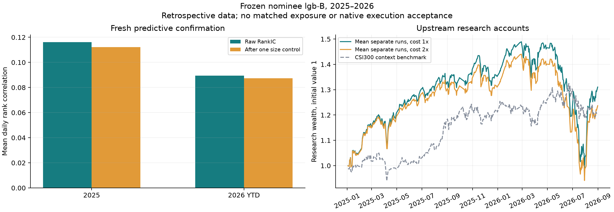

# DL 第二轮：当前本地模型与上游学习方法复现

2026-09-08；本轮离线实验已完成，新闻投资增量尚未验证。本轮按用户同意的补测方案执行，未新增付费 API、生产 Provider、交易引擎或常驻服务。

后续[综合评估与取舍](INVESTMENT_CONCLUSIONS_20260908.md)补充六条冻结账户的回撤路径核对和文档评分失败归类：基础成本下仍有 33.91%–35.00% 回撤，当前组合未达到投资目标。该补查是事后诊断，不改变本报告原始分数或确认集身份。

[冻结协议](research/dl-round2-20260908/protocol.md)覆盖三模型、40 道真实来源财务题和 Qlib 官方横截面基准。此前单 ETF 的失败结果不能推出所有学习方法无效；本轮分别检验文档能力与上游数值研究方法。

## 候选与材料

[当前榜单筛选](research/dl-round2-20260908/screening.md)采用当日 Artificial Analysis v4.3 同版本结果，同时记录其他榜单的可比性缺口。选择现有 Qwen3.5-9B BF16、Qwen3.8-27B UD-Q5_K_M、Gemma 4 12B IT Q5_K_M。后两者是 Unsloth 第三方量化。不同权重精度与运行时共同构成本地部署对照，不能分离为纯模型架构提升。

[材料清单](research/dl-round2-20260908/fixture-manifest.json)记录六家发行人的官方业绩文档。每家六道题，另有四道跨文档题，共 40 道；腾讯、小米、阿里、网易 26 道开发题，百度、美团 14 道确认题。问题、答案、原始来源与哈希先于推理冻结，数字所在 PDF 页经过视觉复核。模型仅看到材料和问题，答案键不进入提示。

六类题覆盖收入及单位、同比、调整后利润、派生算术、构造的支持/反驳陈述和材料未披露的市场一致预期。材料是公开历史文件，可能已进入训练语料；题目按发行人聚类，规模小，不能当作自然分布金融基准或投资有效性证明。

固定评分分离 JSON、值/单位/状态和引用。引用检查验证页码、逐字文本和必要数字的存在，不等于完整语义蕴含判定。额外对象包装、代码围栏和引文改写会单列诊断，原评分与原始输出保留。

## 文档模型开发与确认结果

六个开发配置全部完成；8K 思考输出预算足够，三个试题均正常结束，不需要扩大到 16K/32K。随后在读取确认结果之前[固定各模型模式和额外对照](research/dl-round2-20260908/confirmation-selection.json)，一次性运行百度、美团的 14 道确认题。完整[分数和输出哈希](research/dl-round2-20260908/language-results.json)保留开发与确认分界。

| 确认配置 | 答案值正确 | 值／单位／状态正确 | 原始严格 JSON | 全部检查通过 | 每题中位耗时 |
| --- | ---: | ---: | ---: | ---: | ---: |
| Qwen3.5-9B，非思考 | 9/14 | 9/14 | 14/14 | 8/14 | 3.94 秒 |
| Qwen3.8-27B Q5，思考 | 14/14 | 12/14 | 14/14 | 10/14 | 11.60 秒 |
| Qwen3.8-27B Q5，非思考，附加固定对照 | 10/14 | 9/14 | 14/14 | 7/14 | 2.45 秒 |
| Gemma 4 12B Q5，思考 | 14/14 | 13/14 | 0/14 | 0/14 | 7.38 秒 |

这里“答案值”包括数值、缺失值和陈述标签，不能写成 40 道纯数值题。27B 思考模式的开发与确认答案值均正确（合计 40/40），仍有单位／状态元数据、引用和完整契约失败。Gemma 所有响应使用代码围栏，所以原始严格 JSON 全部失败；这不是所有答案都错误，固定评分已另行解析围栏内容评价答案。开发数据的[次级格式诊断](research/dl-round2-20260908/normalized-diagnostic.json)单列数字字符串、外层包装和缺失值单位，可帮助识别适合由 Harness 处理的问题，没有替换原始分数。

**后续提取候选优先 27B 思考模式，并保留确定性数值／来源核验。** 27B 非思考在开发中的速度优势未转化为相同的留出正确率。当前结果没有形成必须进行 LLM LoRA 的证据：先采用合适模型、受支持的输出约束和可推导元数据处理。Gemma 的围栏问题也不能当作必须训练才能解决的缺陷。

只有两个确认发行人簇，不报告可靠 P95、显著性胜出或金融普遍能力。最长确认题 27B 思考约 69.3 秒、Gemma 思考约 40.2 秒，均为当前样本描述。vLLM/BF16 与 llama.cpp/Q5 的运行时、量化、内核差异共同影响速度。以上不授予生产 Provider 或投资有效性准入。

## Qlib 方法复现

使用上游源码 `79633dd9506ea689e5400dea0197717b5b3d74b7` 的 Alpha158/CSI300 线性与 LightGBM 配置，pyqlib 0.9.7；LightGBM 只固定 16 线程和 seed 17。训练 2008–2014，验证 2015–2016，测试 2017 至 2020-08-01。示例数据来自上游下载脚本指向的公开发布包，固定 SHA-256；实际区间含 690 个不同成分标的，配对样本 252,914 行、868 日，平均每天约 291 个标的。

| 配置 | RankIC | 费用后年化超额 | 信息比率 | 累计超额最大回撤 |
| --- | ---: | ---: | ---: | ---: |
| 上游原配置，线性 | 0.04755 | 9.54% | 1.293 | -16.25% |
| 上游原配置，LightGBM | 0.04841 | 10.42% | 1.166 | -9.64% |
| 清理边界，线性 | 0.04741 | 8.72% | 1.164 | -16.90% |
| 清理边界，LightGBM | 0.04924 | 12.79% | 1.463 | -9.68% |
| 清理边界，线性，双倍费用 | 同一预测 | 4.46% | 0.596 | -19.03% |
| 清理边界，LightGBM，双倍费用 | 同一预测 | 8.19% | 0.937 | -11.55% |

[原配置回执](research/dl-round2-20260908/qlib-reproduction.json)、[边界与成本回执](research/dl-round2-20260908/qlib-strict-results.json)。这里的“年化”是当前 Qlib 按每日均值乘 **238** 的算术年化超额，回撤基于累计超额之和；都不是账户 CAGR 或复利净值回撤。不能将 12.79% 描述为可获得的年收益。

严格补检在拟合前固定：剔除训练和验证末尾两天，预处理拟合截止同步；再对固定预测实际重跑双倍买入、卖出和最低费用的账户。该历史测试在原复现时已打开，因此补检只是敏感性分析，不是新确认集，也未用它搜索参数。[补检边界](research/dl-round2-20260908/strict-followup.md)。

这提供了“维护中的框架确实可以复现正向研究结果”的实测证据，也显示线性基线不可省略。LightGBM 并非在所有指标上都稳定胜过线性。

示例包完全缺少 VWAP 原字段；Alpha158 的相关输入沿用各上游配置的缺失值处理。因此这里复现的是固定代码在可下载示例包上的结果，不声称重新得到论文原始数据成绩。

上游模拟器只用于隔离方法复现。数据存在复权、缺少严格 PIT/修订历史及许可边界；运行时还警告因使用复权价格而不支持 100 股交易单位。它未验证项目的原始成交价、手数、T+1、公司行动、停复牌、Mandate、订单对账与执行幂等，不能直接导入原生收益声明或实盘执行。软件开源许可不等于行情许可。

## AlphaGen 有限搜索对照

Qlib 基线复现后，按已同意的条件分支实际运行了 [AlphaGen 上游](https://github.com/ICT-FinD-Lab/alphagen) 的小预算对照，而非仅建议未来训练。固定源码 `259687e8f316994426416c530a94842a2fe6405e`；调用原生表达式、MSE 因子池、Gymnasium 环境、LSTM 和 SB3 MaskablePPO。[保存模型核验](research/dl-round2-20260908/alphagen-policy-audit.json)确认策略网络只有 **298,609 个可训练参数**：两层 128 维 LSTM，加上各含两层 64 维的策略/价值头；不是 Qwen 这类大语言模型。缺失的 VWAP 保持 NaN，仅通过相同动作掩码禁止两组使用这个字段；没有修改上游源码或编造数据。

[训练前协议](research/dl-round2-20260908/alphagen-protocol.md)固定两组各 4,096 次动作、seed 17、池容量 10、L1=0.005。RL 有八个 rollout/训练周期，每周期十个优化 epoch。标签沿用上游 20 日前向收益，训练和验证各清理末尾 20 个特征日；这与上一节一日标签的 RankIC 不可直接横比。两组池保存完毕之后才读取验证、测试分数。

| 方法 | 训练 RankIC | 验证 RankIC | 历史测试 RankIC | 完成表达式尝试 | 搜索耗时 |
| --- | ---: | ---: | ---: | ---: | ---: |
| 固定 20 日反转 | 0.01366 | 0.09641 | -0.00291 | 固定 1 个 | 未计入搜索 |
| 随机搜索 | 0.05284 | 0.01458 | 0.00433 | 26 | 67.9 秒 |
| MaskablePPO | 0.03137 | 0.08229 | -0.05539 | 58 | 195.7 秒 |

[完整分数、公式与权重](research/dl-round2-20260908/alphagen-results.json)。这里匹配的是表达式动作预算，既不是有效候选数相同，也不是耗时相同。有效进入池比较的尝试为随机 24、RL 48；RL 可能从更多合法表达式中获益，但本次仍未获得测试期增量。20 日标签重叠、只有一个随机种子、预算远低于论文规模，均限制结论。

上游日内归一化会把缺失值变成零，因此本次历史成分外的原始 NaN 在其默认评分路径中并非始终保持排除。扩展实验在调用层排除不具资格的股票，在具资格的股票中保留上游标准化后的零值填补，并让 MSE 目标的所有相关系数使用同一组有标签样本；这也是两个实验不能直接作为纯预算对照的原因。

**本次配置不升级为策略，也不据此否定 AlphaGen。** 它证明了维护框架可以在该设备上实际训练，同时暴露了验证期与测试期方向反转。上游容量 10 的默认预算为 200,000 步，本次 4,096 步约为其 2%；扩展预算、网络或数据范围仍可能改善结果，本次没有排除这种可能。继续投入前应先取得适配目标市场与执行约束的数据、独立时间段及多种子/匹配有效候选预算对照；不应围绕当前已打开的测试期调参。本节没有模拟账户收益或实盘声明。

## 扩展主线

用户进一步授权全市场长历史缓存、GPU 学习方法研究，并明确优先验证数值模型有效性，再检验小模型提取新闻的增量。[扩展冻结协议](research/dl-round2-20260908/expanded-numerical-protocol.md)记录数据范围、时间折、种子、硬件测量与新闻条件门槛。[数值方法筛选](research/dl-round2-20260908/method-screening.md)另列 HARLA、AlphaForge、AlphaPROBE 等方向及实现／预算边界。本轮结论限定于实际测试的配置组合。

全市场缓存已完成：2010-01-04 至 2026-09-07，共 4,051 个交易日、14,350,277 条原始日线、5,832 个历史证券代码。当前上市证券没有作为历史筛选条件；339 个当前退市代码中，271 个在目标区间有日线。衍生研究数据保留 13,359,831 条当时满足资格规则的样本。原始数据与凭据保持私有，公开材料只记录汇总与哈希。 研究复权以每只证券首次有效复权因子为基准，原始价格单独保留；CSI300 只作背景基准，不进入选股股票池。当前历史查询仍不能证明供应商当年的数据版本。

扩展比较包含价格量额、日度估值／规模、初始披露财务三个特征层，Ridge 和三种子 LightGBM；另有两种策略网络，以及按同折同种子两网络中较大唯一入池候选数配置的共同随机搜索对照。总计 42 组训练／搜索、84 次基础或双倍成本账户回放。每组学习搜索固定 131,072 次动作，预算是在开发结果打开前确定的。完整开发审计通过并冻结 LightGBM-B 后，才打开 2025–2026 年模型表现。

CPU 并行度已通过训练数据实测选择：128 个单线程特征进程；每组模型 64 线程。全量数据中两个大内存拟合同时运行触发了一次 OOM，已保留失败证据并将剩余 CPU 拟合改为逐组运行；模型参数与研究预算不变。GPU 搜索按最多两组并发执行，现已全部完成。

## 全市场开发结果

以下均为配置组合的研究结果。股票排序分数与随后五日收益排序的相关性用 RankIC 表示；多种子先按交易日平均，再做 60 日时间块区间。开发区间未作多重比较校正；开发提名尚不等于新时间段确认。

| 配置 | A 折 RankIC | B 折 RankIC | A／B 市值控制后 | 合并原始 95% 区间 | 开发门槛 |
| --- | ---: | ---: | --- | --- | --- |
| ridge-A | 0.08386 | 0.08331 | 0.08458／0.08528 | [0.06725, 0.09359] | 通过 |
| ridge-B | 0.09728 | 0.08912 | 0.09554／0.08898 | [0.07843, 0.10250] | 通过 |
| ridge-C | 0.09757 | 0.08935 | 0.09574／0.08921 | [0.07899, 0.10265] | 通过 |
| lgb-A | 0.08592 | 0.08962 | 0.08662／0.09049 | [0.07064, 0.09778] | 通过 |
| lgb-B | 0.09857 | 0.09242 | 0.09656／0.09350 | [0.07921, 0.10475] | 通过 |
| lgb-C | 0.09865 | 0.08846 | 0.09546／0.08874 | [0.07642, 0.10349] | 通过 |
| lstm | 0.07704 | 0.06685 | 0.07685／0.06472 | [0.05683, 0.08343] | 未通过 |
| transformer | 0.07981 | 0.07988 | 0.07845／0.07833 | [0.06418, 0.09121] | 未通过 |
| random | 0.07727 | 0.07117 | 0.07501／0.06833 | [0.06092, 0.08399] | 通过 |

特征 A 为价量 Alpha158，B 增加日度估值／规模，C 再增加初始披露财务字段；公式搜索使用价量输入。该表不能把不同信息集与特征构造的差异全部归因于网络架构。共同随机对照的目标是同折同种子两网络中较大的唯一入池候选数，并非对每个网络逐一精确等量；只有实际达到目标才算满足预算匹配；未达目标时，学习组合不通过预设的匹配对照门槛。

| 配对增量 | 均值差 | 95% 时间块区间 |
| --- | ---: | --- |
| ridge-B − ridge-A | 0.00961 | [0.00517, 0.01474] |
| ridge-C − ridge-B | 0.00026 | [-0.00052, 0.00125] |
| lgb-B − lgb-A | 0.00773 | [0.00309, 0.01203] |
| lgb-C − lgb-B | -0.00194 | [-0.00602, 0.00185] |
| lstm − random | -0.00228 | [-0.00737, 0.00269] |
| transformer − random | 0.00562 | [0.00097, 0.00958] |

随机对照的实际预算匹配：

| 时间折／种子 | 唯一候选目标 | 实际唯一候选 | 动作数 | 达标 |
| --- | ---: | ---: | ---: | --- |
| A／17 | 8665 | 7618 | 2097152 | 否 |
| A／29 | 5509 | 5509 | 1506371 | 是 |
| A／43 | 8944 | 7618 | 2097152 | 否 |
| B／17 | 9413 | 7657 | 2097152 | 否 |
| B／29 | 6441 | 6441 | 1775957 | 是 |
| B／43 | 8647 | 7659 | 2097152 | 否 |

冻结规则提名：**lgb-B**。

入选组合的账户诊断如下；随机种子各自单独运行，表中是这些账户指标的平均，不是集合预测账户。

| 开发折 | 基础成本累计净收益 | 双倍成本累计净收益 | 双倍成本最大回撤 | 双倍成本相对 CSI300 财富收益 |
| --- | ---: | ---: | ---: | ---: |
| A | 41.05% | 28.77% | -31.22% | 77.18% |
| B | 37.12% | 31.10% | -37.08% | 27.95% |

CSI300 与全市场选股有不同暴露；上述为上游复权价研究模拟，并非原生执行验收。缺少退市最终回收款及供应商历史版本的限制继续成立。

## 新时间段确认

冻结候选 **lgb-B** 的预测确认：**通过**。确认失败时不在同一留出集改选其他候选。

| 年份 | 原始 RankIC | 市值控制后 RankIC |
| --- | ---: | ---: |
| 2025 | 0.11618 | 0.11211 |
| 2026 | 0.08949 | 0.08734 |

合并原始区间 [0.06381, 0.12464]；市值控制后区间 [0.06786, 0.12332]。采用等日历年权重，2026 为截至清理边界的年内样本。

这一确认衡量当前历史数据上的预测稳定性，不授予新闻增量、严格历史 PIT 或自动交易能力。留出期只运行获提名组合，没有重跑其他特征层，因此不是估值或财务增量的独立确认。

确认期各独立种子账户：

| 种子运行 | 基础成本净收益 | 双倍成本净收益 | 双倍成本最大回撤 |
| --- | ---: | ---: | ---: |
| F-B-lgb-17 | 32.71% | 29.67% | -33.27% |
| F-B-lgb-29 | 32.02% | 19.56% | -35.87% |
| F-B-lgb-43 | 28.39% | 21.81% | -35.47% |

确认预测日期截至 2026-08-28，随后一交易日执行的研究账户截至 2026-08-31；两者均由截至 2026-09-07 的已观察日历和六交易日清理边界确定，共 402 个配对交易日。账户采用前 50 名、每日最多替换 5 名，模拟资本 1 亿元，单日成交量限制为 5%。费用敏感性不等于实测冲击成本。三个种子的双倍成本相对 CSI300 财富收益约为 +7.11%、−1.24%、+0.62%，不能表述为所有种子均稳定战胜基准。

## 本轮可以支持的结论

- **存在可复现且通过新时间段确认的数值预测组合。** LightGBM-B 的三种子原始与市值控制后信号均通过冻结门槛；这纠正了由此前单 ETF、小预算失败推导“所有方法无效”的过度结论。市值控制只有一个暴露，未同时控制行业、Beta、风格或交易成本。
- **本轮开发结果支持日度估值／规模特征的增量，不支持继续加入本轮财务字段的稳定增量。** Ridge 的 B−A 为 +0.00961，LightGBM 为 +0.00773，区间均在零以上；C−B 的区间均跨零。它们是所选字段、处理方式与模型配置的结果，不能外推为财务信息普遍无效。
- **GPU 学习方法有正向预测信号，但未满足完整升级门槛。** Transformer 相对实际随机对照的开发配对差为 +0.00562，区间 [0.00097, 0.00958]；LSTM 为 −0.00228，区间跨零。六组随机对照只有两组达到预设的共同候选目标，因此不能把 Transformer 的差异解释成已完成等候选预算验证的学习优势；也没有对学习方法打开新时间段或围绕结果补调预算。
- **预测通过不等于账户与执行通过。** 确认期双倍成本累计净收益为 19.56%–29.67%，最大回撤为 33.27%–35.87%，且有一个种子落后于背景基准。当前供应商历史版本、退市最终回收款、原生手数／T+1／公司行动／订单对账等仍未验收。本轮没有新增生产 Provider、策略授权或实盘入口。
- **文档模型选择与新闻投资增量仍是两项证据。** 27B 思考模式可作为需数值／来源核验的提取候选；当前小样本不支持必须进行 LLM LoRA。新闻接口的公开字段尚不足以恢复严格历史投递与修订证据，当前模型也可能接触过历史事件；[下一步证据要求](research/dl-round2-20260908/news-increment-readiness.md)是冻结后的前瞻成对记录。没有把历史新闻管线演示冒充投资增量验收，也没有购买新权限。

## 资源、失败与完成核验

[搜索审计](research/dl-round2-20260908/expanded-search-audit.json)保留 18 次搜索的真实动作数、候选数、优化次数和耗时。[资源汇总](research/dl-round2-20260908/gpu-resource-summary.json)覆盖约 8.88 小时的全卡采样：最大显存 32,003 MiB、最大功率 604.81 W、最高温度 83°C，积分 GPU 电量约 1.95 kWh。它包含空闲及其他全卡活动，不是某一模型的独占耗电，也不包含 CPU、内存或整机电费。已完成监督拟合的最大父进程 RSS 约 82.09 GiB；表达式搜索的最大 PyTorch 分配显存约 8.53 GiB。

[失败回执](research/dl-round2-20260908/expanded-failures.json)保留训练前相关矩阵适配错误、全量双拟合 OOM 与传输恢复。原调度器因历史 CPU 失败退出码仍为 2；完整验收依据是串行恢复后的 [42 组矩阵审计](research/dl-round2-20260908/expanded-matrix-audit.json)，没有删除失败记录或把退出码改成成功。结束时内核日志仅见已记录的单次 OOM，未见 NVRM Xid。

最终扩展实验包含 42 组开发训练／搜索、3 组独立确认、90 次账户回放和 45 组市值诊断。[确认审计](research/dl-round2-20260908/fresh-artifact-audit.json)核对候选摘要哈希、源码、模型、预处理器、固定配置、日期和费用。45 份最终结果及调用层源码均已与 DL 哈希核对；完整模型与私有数据继续保留在研究目录。

仓库规定的 Ruff、格式检查、Pyright 和 Pytest 已通过；Pytest 为 2,229 passed、212 warnings。后续研究收尾没有修改生产实现；私有实验的功能、预算、身份、边界与结果审计另列于证据目录，不能用仓库测试数量代替实验验收。

[退出检查](research/dl-round2-20260908/cleanup-audit.json)确认本轮计算进程、临时采样与推理容器均已停止，GPU 无计算进程；独立 Netdata 监控保留。模型、缓存、固定代码与回执不删除。设备研究环境登记已同步更新。
