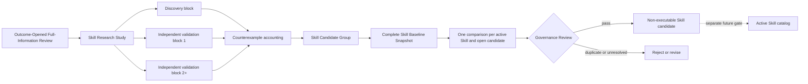

# Skill discovery, governance, trace, and evaluation

## Purpose

This lane turns broad outcome-opened historical research into auditable, non-executable Skill
candidates without allowing hindsight to enter strict PIT, prospective Judgment, Signal, Order, or
execution authority. It also records which Skills a Judgment could see and reportedly used, and
scores practical Judgment quality under precommitted tolerance bands.

The formal term for the requested "full-information hindsight" view is **Outcome-Opened
Full-Information Review**. "Full" means complete within one registered corpus and realized horizon;
it does not claim that the corpus contains every fact in the world.

## Authority and lifecycle

The Harness remains the only orchestration and admission owner. A study, candidate group, or
governance review cannot mutate `skills/`, route itself into a Judgment, create a Pattern Pack,
upgrade a historical evidence lane, or affect a Signal or Order. Active-Skill promotion is a
separate authorized change with its own outcome-blinded holdout or prospective ablation evidence.

## Independent validation

A candidate requires exactly one discovery block and at least two **additional** independent
validation blocks. Each block binds a distinct registered Event Case or distinct time/event-family
block, instruments, source artifacts, a study-registered metric, observed divergence, and
counterexample search. The conservative semantic independence key uses only event family plus time
block. Display IDs, instruments, and source selection cannot turn repeated analysis of one Event
Case/time-family block into another observation. Maximum divergence is frozen in the Study before
analysis; a result block cannot choose or widen its own threshold.

Multiple analysts, models, prompts, debate rounds, or repeated runs over the same block are one
analysis topology, not multiple independent observations. TradingAgents-style event, macro,
industry, issuer, market, positioning, risk, countercase, and synthesis specialists are allowed as
bounded decomposition inside one work unit. Their artifacts and cost are bound, but their count
never increases the validation denominator.

Every additional validation must support the same scoped conclusion and remain inside its
predeclared divergence limit. A refuting counterexample or unresolved material counterexample
blocks candidate admission. A resolved counterexample must narrow applicability, become an encoded
exception, or change the conclusion; "no obvious counterexample" is never represented as a claim
that counterexamples do not exist.

## Category governance

The v1 governance groups are:

| Group | Scope | Outcome-opened candidate rule |
| --- | --- | --- |
| `evidence_authority` | evidence, time, authority, and research discipline | may only clarify or strengthen an invariant; outcome results cannot weaken it |
| `discovery_triage` | discovery, clustering, source-quality, and triage methods | new method candidate allowed |
| `event_transmission` | surprise, expectation, propagation, and causal-chain analysis | new method candidate allowed |
| `macro_regime` | macro vintages, regime, cycle, and cross-asset context | new method candidate allowed |
| `industry_sector` | industry structure, supply chains, substitution, and rotation | new method candidate allowed |
| `issuer_fundamental` | issuer exposure, operations, valuation, and financial statements | new method candidate allowed |
| `portfolio_risk` | held-position exposure, concentration, invalidation, and risk response | new method candidate allowed |
| `market_microstructure` | tradability, liquidity, flow, and market-mechanism analysis | new method candidate allowed; execution policy remains outside Skills |

`DEFAULT_SKILL_GROUP_ASSIGNMENTS_V1` classifies every current runtime Skill. The Harness builds a
complete baseline from all runtime manifests, both research catalogs, instruction hashes, and every
admitted open candidate. Missing group assignments, catalog-only names, duplicate candidates, or a
candidate/review mismatch fail before semantic review.

The review then requires exactly one relationship and resolution for every baseline subject:

- duplicate -> reject duplicate;
- subsumed -> keep existing, reject, or request a real exception rewrite;
- extension -> merge as a new version or coexist with non-overlapping scope;
- specialization -> scoped coexistence or exception;
- conflict -> replace, merge, scoped coexistence, reject, or revise both; and
- orthogonal -> no action.

`replace` and `merge` describe a candidate disposition only. They do not edit an active catalog.
Likewise, `narrow_to_exception` blocks the current group: the narrower proposition, applicability
conditions, exceptions, and validations must be emitted as a new content-identified Candidate
Group and reviewed again. A comparison record cannot claim a rewrite absent from candidate content.

## Judgment Skill Trace

`JudgmentSkillTrace.v1` is a content-identified sidecar, not a rewrite of historical Judgment
Artifact v2. It binds the exact Judgment, Skill Route, Agent Execution Binding, and one entry per
offered or dependency Skill. Each entry records:

- offered versus dependency-only;
- selected, loaded dependency, or rejected route state and reasons;
- exact manifest hash for every loaded Skill and explicit `null` for an unloaded/rejected Skill;
- evidence references that triggered consideration;
- `applied`, `consulted_not_applied`, `not_applicable`, or `not_reported`; and
- proposal JSON paths reportedly influenced.

The Harness reopens the content-identified `SkillRoute`, checks its complete requested/loaded name
and loaded manifest-hash surface, and requires route dispositions and reasons to equal frozen route
facts. A rejected offer cannot invent a version hash or reason that the route never recorded. The
Harness also compares every `AgentExecutionBinding` field represented in the Judgment—not only the
Skill hashes—and verifies Evidence Pack references and proposal paths. The
model's use/influence statement remains observational self-report. It can diagnose routing and
support later ablation design; it cannot prove causal contribution, size a position, change
approval, or authorize execution. Existing Judgments remain valid but are trace-ineligible for a
new Skill-effectiveness claim until an exact sidecar exists.

## Practical Judgment tolerance

Backtest, paper, and later live observation may evaluate a Judgment more tolerantly than exact
Signal agreement. A `JudgmentEvaluationBandSpecification.v1` must be frozen after the Judgment and
before outcome opening. It binds one proposed target and:

- expected up/down direction;
- earliest/latest evaluation session;
- terminal total-return interval and a policy maximum width;
- realized-volatility interval, basis, and policy maximum width; and
- maximum adverse excursion.

The result reports every component separately and calls the Judgment `broadly_correct` only when
all five pass. The exact tolerance policy comes from a content-identified catalog durably
registered by the Harness before the Agent run. Both specification construction and result
evaluation reopen the SQLite registration through an authority boundary; a caller-supplied or
backdated catalog is not accepted. The policy owns horizon, band-width, adverse-excursion,
price-basis, and volatility-basis limits; the result specification may only narrow them. System
ceilings reject a return-band width
above 100%, a volatility-band width above 500 percentage points, or a latest horizon beyond 1,260
sessions, while domain policies should normally be much tighter. A caller therefore cannot mint a
policy hash or widen a range after seeing the Judgment or outcome.
The result is evaluation-only and cannot relax exact target/direction agreement, Query Gate,
Decision Admission, mandate, approval, reconciliation, or any paper/live gate.

## Implemented and open acceptance

Implemented with deterministic fixtures:

- content-identified Skill Research Study, Candidate Group, Governance Review, Skill Trace,
  Evaluation Band, and Evaluation Result contracts and JSON Schemas;
- one discovery plus at least two independent-validation gates;
- study-precommitted divergence, material-counterexample, category, and full-baseline conflict
  gates;
- complete current runtime/two-catalog baseline construction; and
- negative tests for pseudoreplication by repeated analysis, renamed IDs, or varied source sets;
  missing catalog coverage; unmaterialized exception narrowing; false route/Skill-use/binding
  claims; rejected Skill identity/reason fabrication; late/backdated/self-declared evaluation
  policy; over-wide bands; post-outcome evaluation; and wrong direction.

Still open:

- automatic sidecar emission by each registered model adapter;
- a real registered multi-case Skill Research Study and first admitted candidate;
- candidate effectiveness on a later pristine holdout or prospective cohort;
- any explicitly authorized active-catalog edit; and
- restoration of the prospective collector route-health drift before the first real checkpoint.
